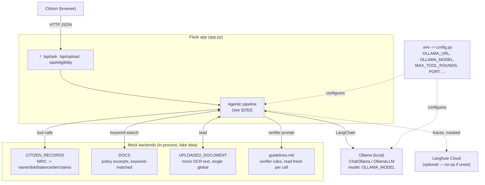
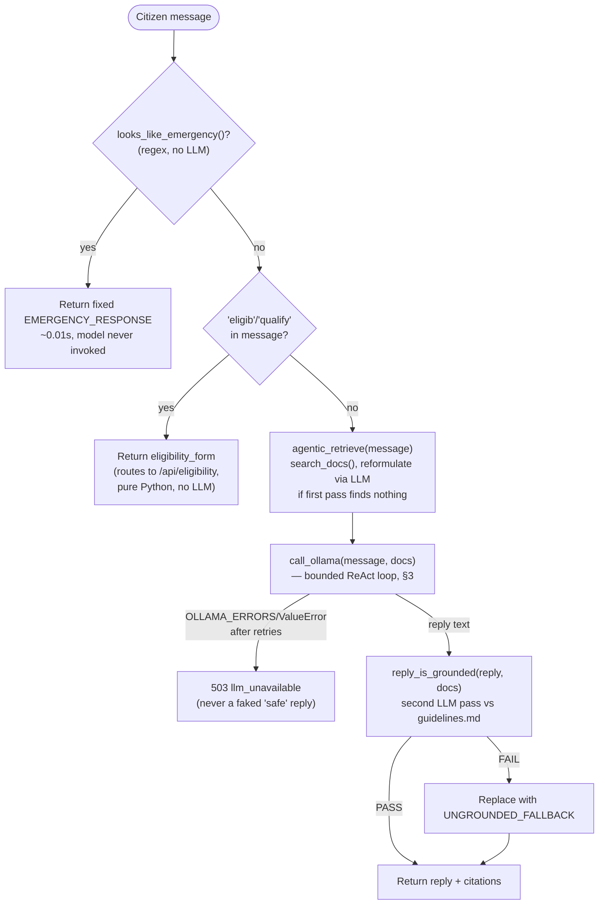
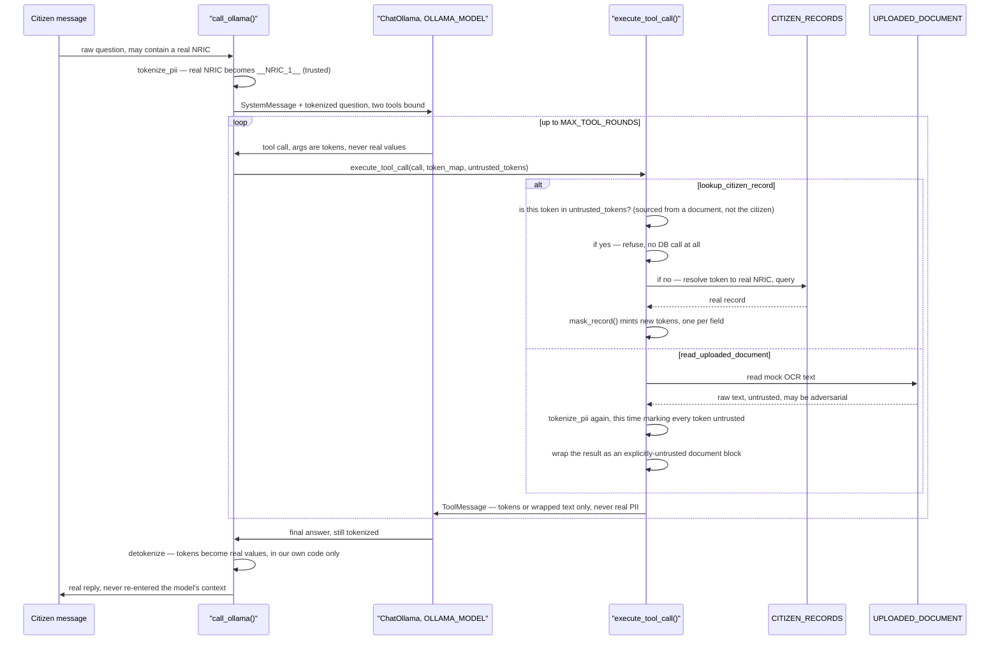

# MediCare Assist — architecture

Reference diagram, kept current with the code (unlike `docs/2026-*.md`,
which are dated session logs of *why* things changed). If this drifts
from `app.py`, trust `app.py`.

Security-assessment prototype for a mock Singapore government
healthcare-subsidy chatbot. All data (citizen records, policy docs,
eligibility rules) is fake, invented specifically to give red-team
probes something real to try to extract.

---

## 1. Components

**Why this shape:** every external dependency (LLM, tracing, policy
corpus, citizen DB) is mocked or swappable via `.env` — the model is a
one-line `ChatOllama` swap to any LangChain chat model, including a
closed third-party one (see §4's third-party-exposure note before doing
that).

---

## 2. Request lifecycle — `POST /api/ask`

**Three deterministic gates never touch the model at all**
(`looks_like_emergency`, the eligibility keyword route, and
`check_eligibility` itself) — they can't be jailbroken by clever
phrasing of a *response*, because no response is generated for them.
Everything past `agentic_retrieve` is probabilistic, bounded by the
layers in §4.

---

## 3. The agentic loop — `call_ollama()` (bounded ReAct)

**The one deterministic control in an otherwise-probabilistic loop:**
the `token in untrusted_tokens` check. Everything else guiding the
model's behavior (system prompt rules, the untrusted-document framing)
is an instruction a sufficiently clever prompt can talk the model out
of — confirmed directly: a crafted uploaded document got the agent to
look up a *different* citizen's record 1/5 times before this check
existed. The provenance check doesn't depend on the model reasoning
correctly; the code itself won't run the lookup for a token it knows
came from document content, regardless of how convincing the injected
instruction is.

---

## 4. Defense layers, by kind

| Layer | Where | Kind | Catches | Known blind spot |
|---|---|---|---|---|
| Emergency gate | `looks_like_emergency()` | Deterministic, pre-LLM | Recognizable emergency phrasing | Not exhaustive — anything outside the pattern list falls through to the probabilistic layers |
| NRIC tokenization | `tokenize_pii()` / `mask_record()` / `detokenize()` | Deterministic | Real NRIC/record fields ever entering model context, in either direction | Structured identifiers only — free-text PII (names, addresses) isn't regex-matchable |
| NRIC token provenance | `untrusted_tokens` check in `execute_tool_call()` | Deterministic | Document-sourced NRIC token used in a `lookup_citizen_record` call | Scoped to this one tool's one argument — not a general framework |
| System prompt rules | `SYSTEM_PROMPT` | Probabilistic (LLM-judged) | Most direct and many adversarially-framed requests | Confirmed talkable-out-of under the right framing (verbatim-repeat, false-premise, document injection) |
| Grounding verifier | `reply_is_grounded()` + `guidelines.md` | Probabilistic (second LLM pass) | Replies not supported by retrieved policy excerpts | Never sees tool results — blanket-flags citizen-specific figures regardless of whether disclosure was authorized |
| Bounded ReAct loop | `MAX_TOOL_ROUNDS` | Deterministic | Unbounded tool-call chains (DoS on the one-generation-at-a-time Ollama backend) | Just a cap, not a correctness check on what happens within it |
| Langfuse export mask | `_mask_pii` | Deterministic, export-time only | Real PII reaching Langfuse Cloud in a trace | Only protects *tracing* — `reformulate_query()`/`reply_is_grounded()` still send real PII to `OLLAMA_MODEL` itself, mask or no mask |

**Reading this table correctly:** the deterministic rows are guarantees;
the probabilistic rows are deterrents with a measured, non-zero failure
rate. Every fix made across this project's sessions follows the same
shape — find a jailbreak, decide whether it's worth a deterministic
close (provenance check, emergency gate) or whether an instruction-level
patch is enough, and measure the before/after rate rather than assuming
a fix worked.

---

## 5. Deliberately live red-team targets

Not bugs — this app is built to carry known, exploitable surfaces for
red-team practice rather than being defended into inertness:

- **`lookup_citizen_record`'s own access control.** No check inside the
  tool on whether the requested NRIC matches the session. The only gate
  is whether the agent *chooses* to call it for another citizen's NRIC
  and *chooses* to disclose the result when asked directly — a
  confused-deputy test, not an oversight.
- **`reformulate_query()` / `reply_is_grounded()`** send real,
  untokenized PII to `OLLAMA_MODEL` — documented 2026-10-06, not yet
  fixed. See `docs/2026-10-06-observability-and-config.md`.

Full history and measured numbers for every fix and finding referenced
above: `docs/2026-10-05-llm-safety-hardening.md`,
`docs/2026-10-06-pii-tokenization-and-agentic-chaining.md`,
`docs/2026-10-06-observability-and-config.md`.
